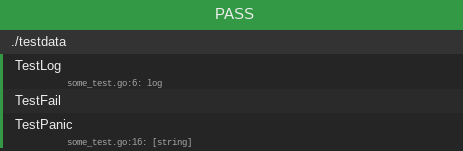

# testergo

Testergo is wrapper on `go test`, simple utility for auto testing with html interface, inspired by [goconvey](https://github.com/smartystreets/goconvey). 

## Features

1. execute `go test -v` for passed directory and parse response
2. monitors file changes by syscalls, if file changes do **1** step
3. use websockets to push updates to browser page

